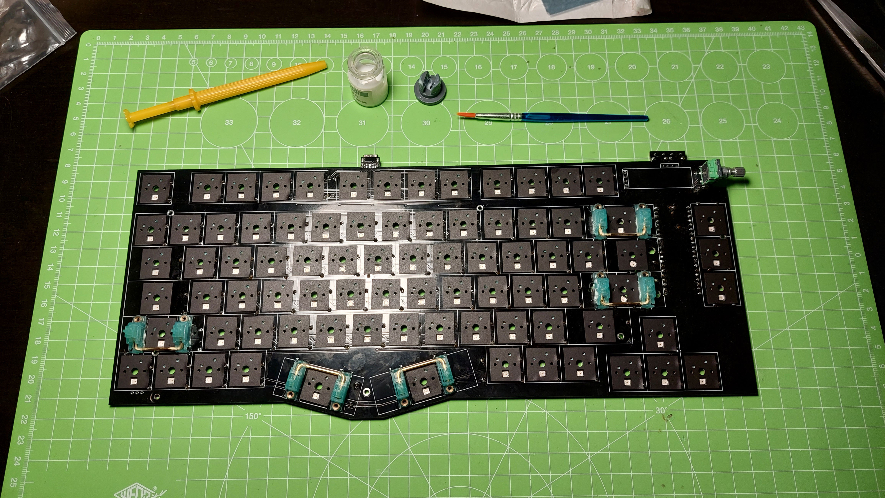

# Kanagawa rev2.1 build guide

As the Kanagawa keyboard has reached a nearly finished state with the revision 2.1, I prepared a much needed build guide.

This board is made of a sandwich keyboard (3 layers of PCB) enclosed in a 3D printed case.

## Parts

### PCB, plate and decorative backplate

PCB 1.6mm
Plate 1.2mm Chose ANSI or ISO
Back plate 1.6mm

(gerber files available [here](https://github.com/Ciaanh/keyboards/tree/main/Kanagawa/rev2.1/generated_pcbs/gerber))

PCB mounting screws

|Parts|Link|
|-----|----|
|7x 8mm M2 flat head screws | https://fr.aliexpress.com/item/32581771052.html |
|7x 4mm M2 hex spacer for 1.2mm plate | https://fr.aliexpress.com/item/32973837702.html |
|7x M2 nuts | https://fr.aliexpress.com/item/32799892197.html |

Case assembly screws

|Parts|Link|
|-----|----|
|8x 12mm M2 screws | https://fr.aliexpress.com/item/1005003106065254.html |
|8x 7mm M2 hex spacers | https://fr.aliexpress.com/item/32973837702.html |
|8x 5mm M2 screws | https://fr.aliexpress.com/item/33007621009.html |

Components

| Parts                                         | Link                                                 |
| --------------------------------------------- | ---------------------------------------------------- |
| 1x OLED screen 0.91" x32 pixels               | https://fr.aliexpress.com/item/32850288143.html      |
| 1x horizontal rotary encoder                  | https://fr.aliexpress.com/item/1005002431755556.html |
| 1x encoder knob                               | https://fr.aliexpress.com/item/4000495929705.html    |
| 83x Kailh switch hotswap sockets              | https://fr.aliexpress.com/item/1005003166749340.html |
| 1x USB C socket GCT USB4085-GF-A              | https://gct.co/newark/connector/usb4085              |
| 2x `3*6*5` push buttons                       | https://fr.aliexpress.com/item/1005003725314964.html |
| 4x 2U stabs for ISO, 5 for ANSI               | https://fr.aliexpress.com/item/1005003101683037.html |
| 84x through hole 1N4148 diodes                | https://fr.aliexpress.com/item/32729204179.html      |
| 2x 5.1k ohms through hole resistor            | https://fr.aliexpress.com/item/4001184762251.html    |
| 83x SK6812MINI-E RGB LED for ISO, 82 for ANSI | https://fr.aliexpress.com/item/1005004908622116.html |
|  |  |
| 1x Raspberry Pico |  |
| 83x MX switches for ISO, 82 for ANSI - 5 pins switches recommended |  |

Keycaps

Just choose your preferred keycaps set but there is some points to consider :

- right Shift key is a 1.75U
- control, alt and function modifier are all 1U
- the splitted spacebar is made of one 2.25U and one 2.75U

## Before assembly

Make sure you have decided which layout (ISO or ANSI) you are building.

Flash the firmware on the microcontroller. You just need to retrieve a uf2 file corresponding to the layout you are building, plug the Pico to your PC while pushing the Bootsel button on the Pico and drag the desired firmware on the mounted drive.

The default firmwares can be found [here](https://github.com/Ciaanh/keyboards/tree/main/Kanagawa/rev2.1/Firmware)

## Assembly

### 1 Install diodes and resistors

Always better to start with the diodes (remember that the black stripe on the diode goes on the same side as the bar on the diode symbol) and keep four diode legs for the Raspberry Pico later.

Solder the 5.1kΩ resistors which are needed for the USB C port as a handshake with the host regarding the power needed for the device.

### 2 Install USB port and micro controller
Solder the USB port which should face downward (very good guide [here](https://www.youtube.com/watch?v=ydPFCHNuRGM)).

In order to solder the Raspberry Pico we need to prepare the pad on the back of it. We are using the TP1 TP2 TP3 for the USB C port and TP6 for the Bootsel button.

Add a small amount of solder on the pads and solder diode legs before placing the Pico on the board without any spacer, the Pico should be in contact of the PCB.
Just solder 3 or 4 pins of the Pico then flip the board and solder the diode legs. Flip again the board and finish soldering the Pico

Check that there is no short-circuit with a multimeter, a small error is easier to fix at this point (I use cut USB cables to check continuity between the Pico port and the board USB C port).

### 3 Install switches

Solder the two buttons for reset and bootsel.

### 4 RGB matrix [optional]

If you want to use the RGB Matrix it is time solder the RGB diodes.
If you are making an ANSI board don't forget to solder the jumper under the KE1 switch to bypass the KE1 RGB diode and not to solder an RGB diode at the KE1 position

### 5 Install hotswap sockets

Solder the hot-swap sockets and be careful if you are making an ISO or ANSI board

### 6 Install rotary encoder

Solder the rotary encoder which should face upward.

### 7 Place the stabilizer on the PCB

### 8 Case assembly - part 1

Place the PCB support screws and standoffs on the plate, then place the plate in the right side of the case with the two screws and hex standoffs.

If you are using foam between the plate and the PCB it is the right time to place it.

Flip the plate and right side of the case then insert the rotary encoder with the PCB at an angle being careful of the two switches.

Once in place use the M2 nuts to screw the PCB to the plate.

### 9 Place the Oled screen

Place and solder the Oled screen, I recommend to use two spacer or leave around 5mm between the board and the screen.

### 10 Case assembly - part 2

Place and screw in the remaining parts of the case from the right to the left of the board.

Once all sides are screwed in place the dampening foam if using any and finally close the keyboard using the decorated backplate and screw it in.

Check all screws are tight then place the switches.

Just remain to put the keycaps and enjoy your new keyboard.